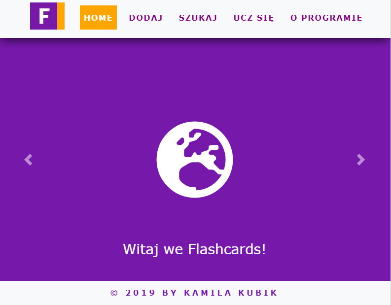
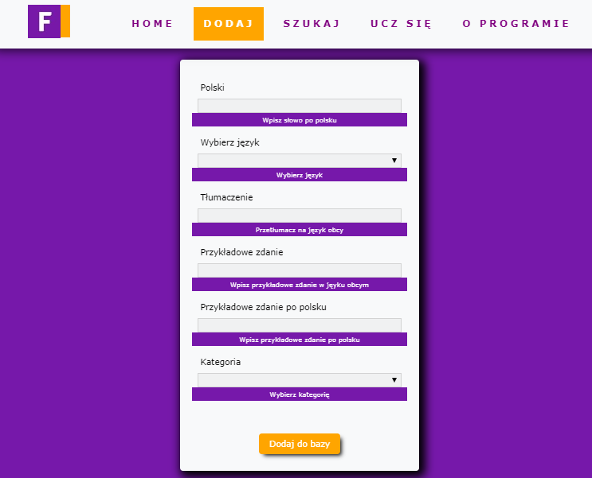
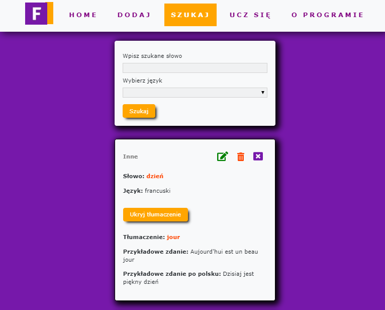

# Update 08.2019
1. I added to each card a timer in learning section and number of each card. Now you will know how much flashcards is in a database. 
2. Now it doesn't matter if you search the word in lower case letters or capital letters. 
If you earlier saved the word in Flashcards App you can be sure that you find it.

# FlashcardsApp - React
My project "FlashcardsApp - React" was created during Coders Lab course. This is my final project.
 

## Used technologies
I used React, HTML, CSS, JavaScript, Bootstrap, RWD and Firebase.
## Usage
To start using this app click here: http://flashcards.kubikweb.usermd.net/ 
 
## About
Flashcards App is a program dedicated to Poles. The program helps in learning a foreign languages. It has 3 modules:
1) Add flashcards - the user can add new flashcard to the database. 
2) Search flashcards - the user can search database, edit, delete or close the found flashcard.
3) Learn flashcards - the user after choosing a language has 10 seconds to remember the flashcard. 









See you next time!

```javascript
	var author = "Kamila Kubik";
	var position = "junior frontend developer";
	alert('${author} - ${position}, 05/04/2019');
```
